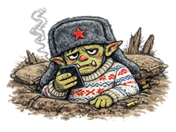
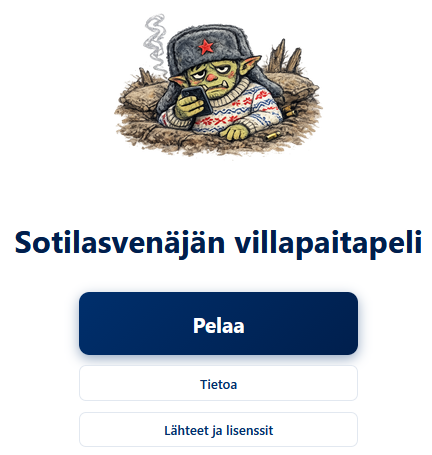
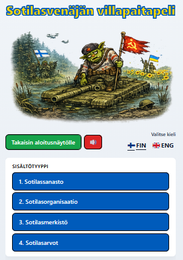
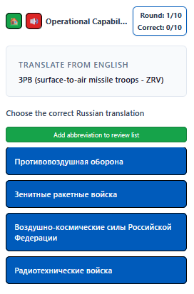
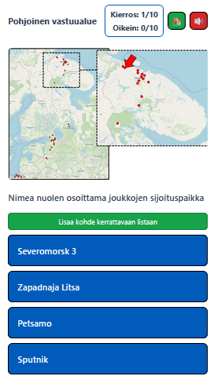
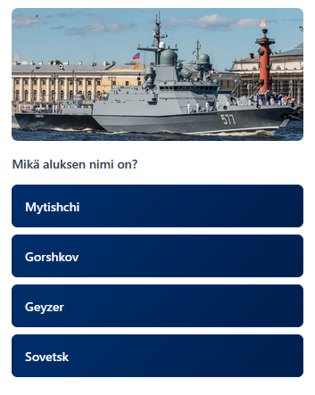
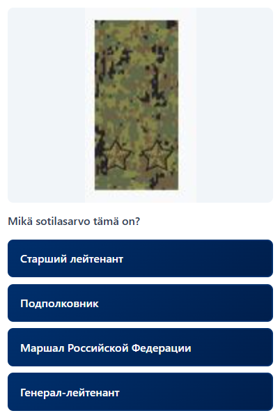
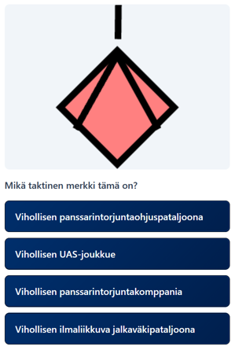

# Sotilasvenäjän villapaitapeli

## Purpose

Sotilasvenäjän villapaitapeli on tietovisatyyppinen oppimispeli venäläisen sotilassanaston ja sotilaskulttuurin opiskeluun. Sovelluksessa esitettävien tekstien ja kuvien avulla voit harjoitella venäjänkielistä sotilassanastoa sekä tutustua Venäjän sotilaspiirien toiminta-alueisiin, puolustushaarojen suorituskykyihin, venäläisiin sotilasarvoihin ja taktisiin merkkeihin. Sovellus toimii selaimessa ja Android-laitteilla.

**Kuva:** Aloitusnäyttö.

---

## Sisältö

Päävalikosta valitaan yksi neljästä sisältötyypistä. Jokainen vaihtoehto vie ensin alavalintoihin (esim. kieli, toiminta-alue tai puolustushaara) ja sen jälkeen 10 kysymyksen kierrokseen, jossa jokaisessa kysymyksessä on neljä monivalintavaihtoehtoa.

**Kuva:** Sisältövalikossa on tällä hetkellä neljä sisältötyyppiä: Sotilasvenäjän sanasto, Venäjän asevoimat, sotilasarvot ja taktiset merkit.

---

### Sotilasvenäjän sanasto

Näet sanan toisella kielellä ja valitset oikean käännöksen toiselta kieleltä. Voit valita harjoituksen suunnan (suomi → venäjä tai venäjä → suomi) sekä sanalistan (esim. Rintamavenäjän alkeet, Sotilasvenäjän perusteet).

**Kuva:** Pelinäkymä, jossa näkyy kysymyssana ja neljä vastausvaihtoehtoa.

---

### Venäjän asevoimat

Tämä kokonaisuus sisältää moduuleja Venäjän sotilaspiireihin liittyen.

#### Sotilaspiirit

Kokonaisuudessa näet karttakuvan, jossa on merkitty asevoimien sijoituspaikkoja, joista valitset oikean nimen neljästä vaihtoehdosta. Toistaiseksi valittavissa vain Leningradin sotilaspiiri.

**Kuva:** Pelissä esitetään kartta ja neljä asevoimien sijoituspaikan vaihtoehtoa.

#### Puolustushaarojen suorituskyvyt

Kokonaisuudessa näet kuvia Venäjän kineettisen vaikuttamisen suorituskyvyistä, jotka sinun tulee tunnistaa tyypin, luokan tai yksilöiden nimen perusteella. Toistaiseksi valittavissa on vain Itämeren laivaston alusten alusluokat ja alusten yksilöidyt nimet.

**Kuva:** Pelissä yksilöidään suorituskykyjä.

---

### Sotilasarvot

Näet kuvan venäläisen sotilasarvon arvomerkeistä ja valitset oikean arvon neljästä vaihtoehdosta. Sotilasarvojen kieleksi voi valita suomen tai venäjän.

**Kuva:** Pelissä näkyy sotilasarvon arvomerkki ja neljä sotilasarvon nimivaihtoehtoa.

---

### Taktiset merkit

Näet taktisen merkin ja valitset oikean joukkotyypin neljästä vaihtoehdosta. 

**Kuva:** Pelissä näkyy taktisen merkin kuva ja neljä tekstivaihtoehtoa.

---

## Kehitys

### Sanastotiedostot (CSV)

Sanastokyselyt lukevat sanat tiedostoista kansiosta **public/data/**.

- **Kaksisarakeinen muoto** (yleinen): `Russian,Finnish`. Jokainen rivi on yksi oikea pari; väärät vaihtoehdot valitaan satunnaisesti muista riveistä.
- **Viisisarakeinen muoto (prompt + 4 vaihtoehtoa)** – yksi kysymysrivi ja neljä venäjänkielistä vaihtoehtoa (1 oikea, 3 vääriä):
  - Sarakkeet: `prompt,ve1,ve2,ve3,ve4`. Otsikkorivi: `prompt,ve1,ve2,ve3,ve4`. **ve1** = oikea vastaus, ve2–ve4 = vääriä vaihtoehtoja.
  - Sovellus näyttää promptin (esim. lyhenne + suomenkielinen selitys suluissa) ja neljä sekoitettua vaihtoehtoa. Käytä tätä esim. tiedostossa **public/data/lyhenteet-venäjä.csv** (moduuli „Lyhenteet (venäjänkielinen laajennus)”).
- **Kahdeksansarakeinen muoto (lyhenteet)** – yksi oikea ja kolme omia väärää vaihtoehtoa per rivi:
  - Sarakkeet: `Russian,Finnish,Finnish_alt1,Finnish_alt2,Finnish_alt3,Russian_alt1,Russian_alt2,Russian_alt3`
  - Kun kysymys on venäjäksi (ru→fi), neljä vaihtoehtoa ovat: oikea suomi + Finnish_alt1–3.
  - Kun kysymys on suomeksi (fi→ru), neljä vaihtoehtoa ovat: oikea venäjä + Russian_alt1–3.
  - Voit täyttää lyhenteet-CSV:t omilla lyhenteillä ja neljällä samankaltaisella vaihtoehdolla (1 oikea, 3 vääriä).

Tiedostot UTF-8 -merkistöllä. Ensimmäinen rivi voi olla otsikkorivi (Russian,Finnish,...).

---

Pelin lähdekoodi on saatavilla GitHubissa osoitteessa:
**https://github.com/datadruidi/sotilasvenajan-villapaitapeli**

Koska projektia ylläpitää yksi kehittäjä, siinä voi ajoittain esiintyä virheitä, päivitykset voivat viivästyä ja osa ominaisuuksista voi olla vielä keskeneräisiä. 

---

## Julkaisu Google Play -storeen

Sovellus on paketoitu Android-sovellukseksi (Capacitor). Julkaisua varten:

1. **Rakenna allekirjoitettu AAB:** ohjeet tiedostossa [android/RELEASE.md](android/RELEASE.md).
2. **Play Consolen ja kaupallinen listausta:** tarkempi lista [docs/GOOGLE_PLAY_SHIPPING.md](docs/GOOGLE_PLAY_SHIPPING.md).

Yhteenveto: Google Play -kehittäjätilin luonti (maksu noin 25 USD), store listing -tekstit ja kuvat, sisältöluokitus, tietosuojaseloste (URL) ja AAB-tiedoston lataus Production-julkaisuun.

---

## Palaute ja ominaisuustoiveet

Jos sinulla on palautetta tai haluat ehdottaa uusia moduuleja tai sisältöä, voit lähettää sen osoitteeseen:

**villapaitapeli.shaky136@passmail.net**---## Vastuuvapauslauseke
Lataat ja käytät tätä sovellusta omalla vastuullasi. Tekijä ei vastaa ohjelmiston tai sen sisällön käytöstä aiheutuvista suorista tai välillisistä vahingoista eikä mahdollisesta väärinkäytöstä. Kaikki sovelluksessa käytetty tieto perustuu avoimista lähteistä saatavilla olevaan tietoon. Käytä sovellusta sovellettavan lainsäädännön sekä organisaatiosi ohjeistuksen mukaisesti.