# Military Russian 101

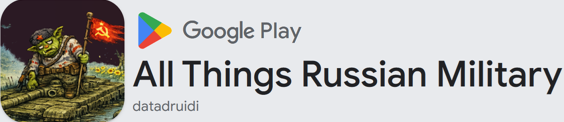

Military Russian 101 is a learning game. It teaches Russian military words and topics. The app is available in Finnish and English.

Play in a browser at [villapaitapeli.fi](https://villapaitapeli.fi). You can also get it from [Google Play](https://play.google.com/store/apps/details?id=com.sotilasvenajan.villapaitapeli).

## Main screen

The main screen has six choices:

1. Military Quiz
2. Military Memory Game
3. Short War Stories
4. Daily OSINT Brief
5. Equipment Catalog
6. Information & Settings

You can also change the language. Links to GitHub, Google Play, and feedback are at the bottom.

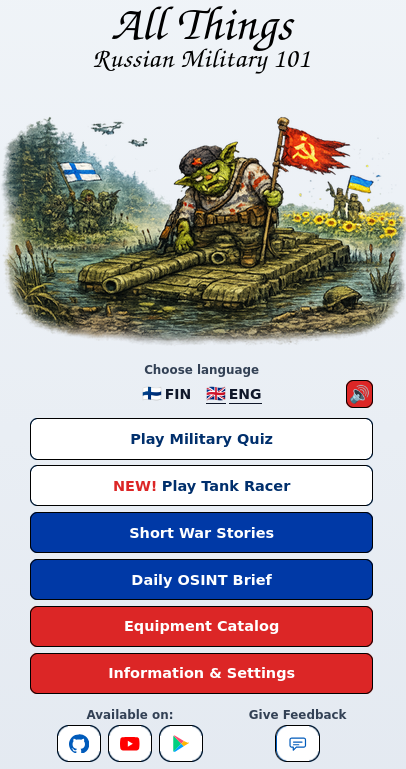

## 1. Military Quiz

The quiz has four main sections:

1. Military Vocabulary
2. Military Organization
3. Military Symbology
4. Military Ranks

Most games have ten questions. Each question has four choices. The app saves the number of completed rounds.

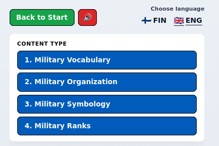

### 1.1 Military Vocabulary

This section has two parts. They are Military Operations and Military Abbreviations.

#### Military Operations

This part has eight word lists:

- Weapons and Ammunition
- Equipment and Platforms
- Organization Structure
- Training and Tasks
- Combat and Tactics
- Terrain and Fortifications
- Military Ranks
- Cybersecurity Terminology
- Review

You can answer in Finnish or English. You can also answer in Russian. You can add difficult words to the Review list.

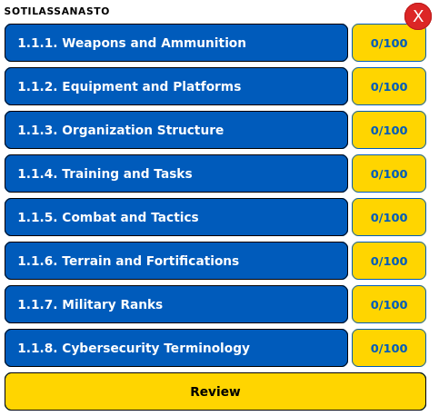

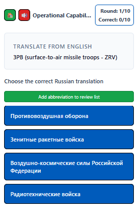

#### Military Abbreviations

This part has six lists:

- Security and Intelligence Agencies
- Defense Administration and Command
- Main Branches and Special Forces
- Operational Capabilities
- Equipment Capabilities
- Leadership, Administration and Daily Terms
- Review

The game shows a prompt in Finnish or English. You choose the correct Russian abbreviation. Abbreviations have their own Review list.

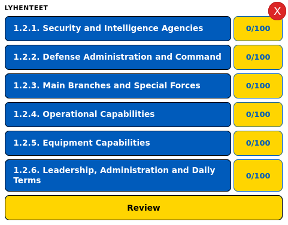

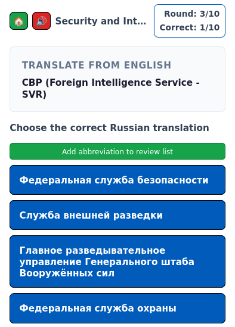

### 1.2 Military Organization

This section has two parts. They are Military Capabilities and Military Districts.

#### Military Capabilities

This is an image quiz. You identify military equipment from a picture.

The available branches are:

- Ground Forces
- Navy
- Aerospace Forces
- Strategic Missile Forces
- Airborne Forces
- Unmanned Systems Forces

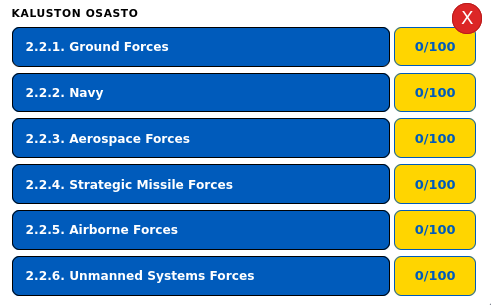

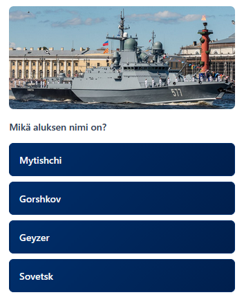

#### Military Districts

This part has two games:

- Military District Bases
- Military District Insignia

##### Military District Bases

The current game covers the Leningrad Military District. You identify a base on a map. You can save bases to the Review list.

The Central, Eastern, Moscow, and Southern military districts are shown as future options. They can be added by request.

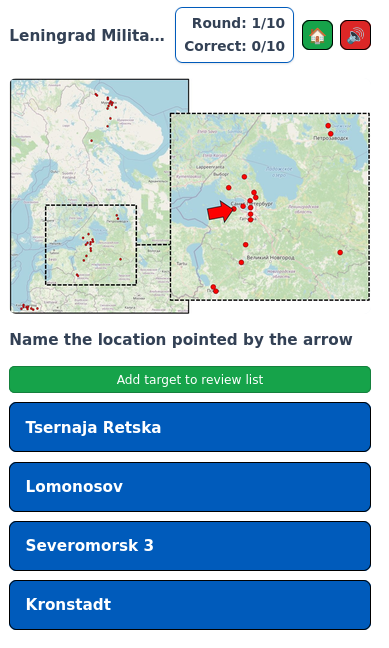

##### Military District Insignia

This is an image quiz. You identify a military district insignia.

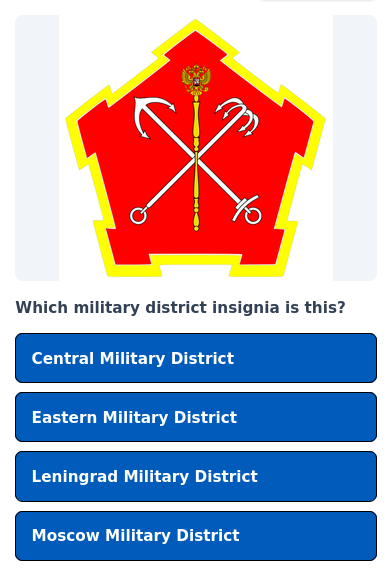

### 1.3 Military Symbology

You see a military symbol. You choose its correct meaning.

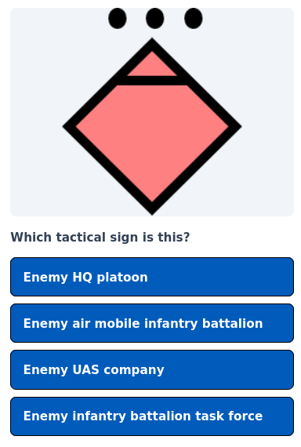

### 1.4 Military Ranks

This section uses Russian Ground Forces rank insignia.

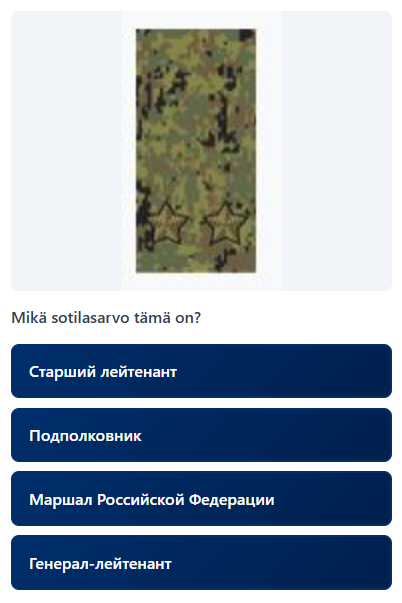

## 2. Military Memory Game

The Memory Game opens in a new page. You match military images and names.

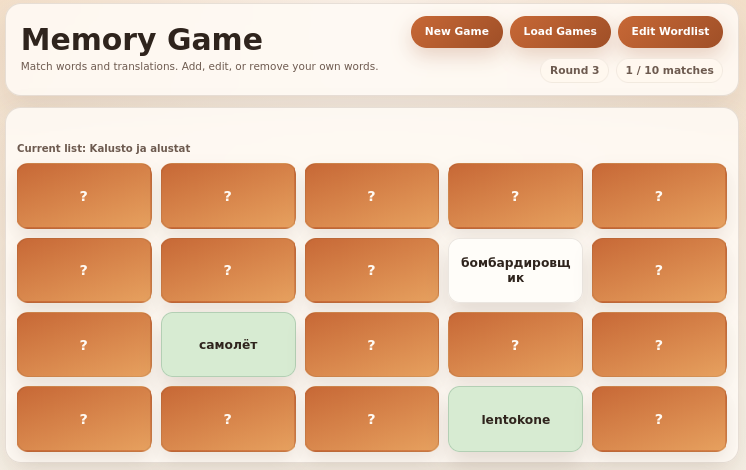

## 3. Short War Stories

These stories follow Private Ivan near the front in Ukraine. The text is in Russian. English translations help you study each sentence. Each available story has audio. You can play, pause, restart, and seek the audio. The full story is also available as one long recording.

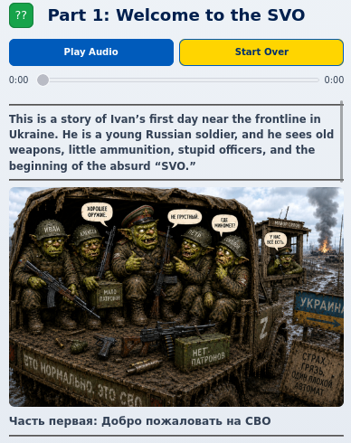

## 4. Daily OSINT Brief

The brief gathers information from Russian-language sources. AI translates and analyzes it. 
The browser brief updates every day. You can also read older briefs.

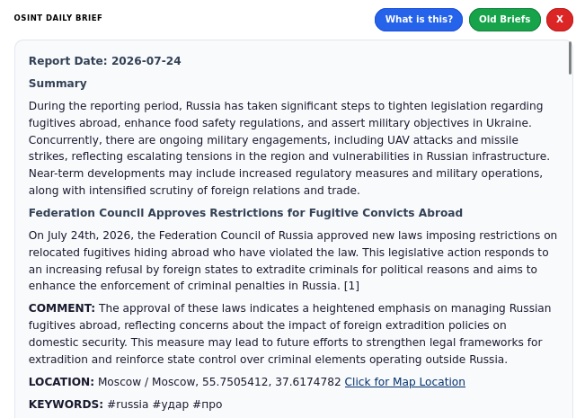

## 5. Equipment Catalog

The catalog is a study reference. It has pictures and short equipment details.

The catalog has six sections:

- Ground Forces
- Navy
- Aerospace Forces
- Unmanned Systems
- Airborne Forces
- Strategic Missile Forces

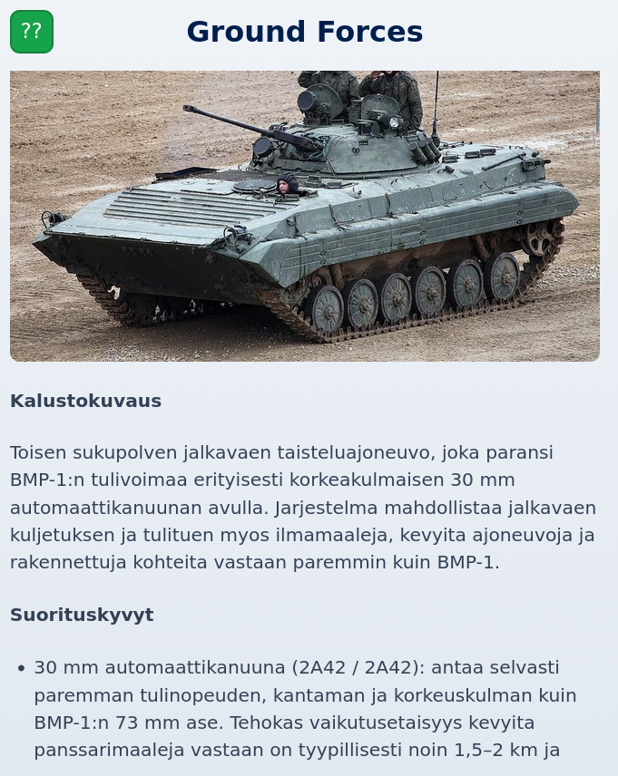

## 6. Information & Settings

This menu has four sections:

- About
- Updates
- Sources & Licenses
- Soundtrack

## Source code

The source code is on [GitHub](https://github.com/datadruidi/sotilasvenajan-villapaitapeli).

The project has one main developer. Some parts may still be unfinished.

## Feedback

Send email to **villapaitapeli.shaky136@passmail.net**.

You can also use the [anonymous feedback pad](https://pad.riseup.net/p/MqxWfBo7cIo-x0yPks6g-keep).

## Disclaimer

The information comes from open sources. Follow the law and your organization rules.

## Privacy

The website uses Cloudflare Web Analytics. It counts visits and page use. It does not use cookies. It does not collect personal data or store unique IDs. The app has no user accounts, logins, or forms.

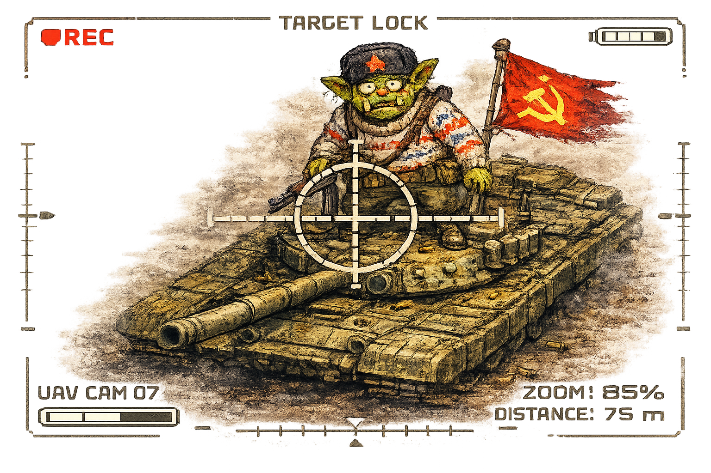
